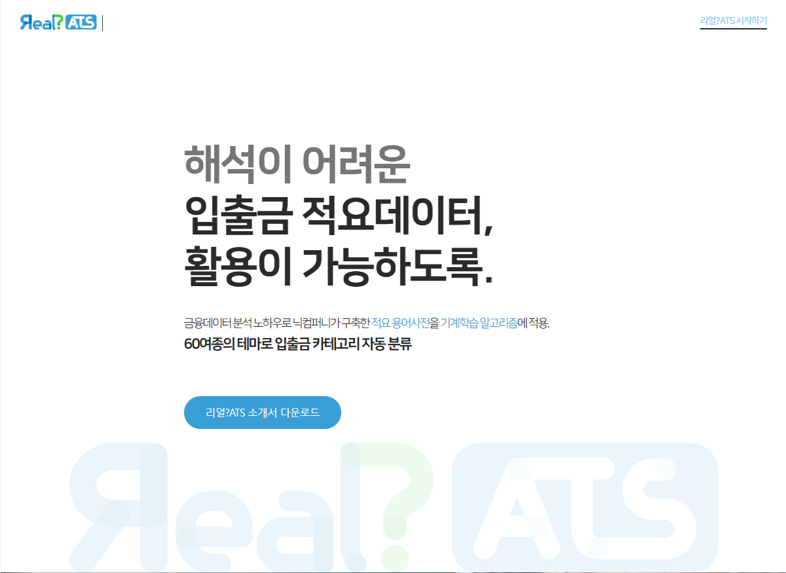
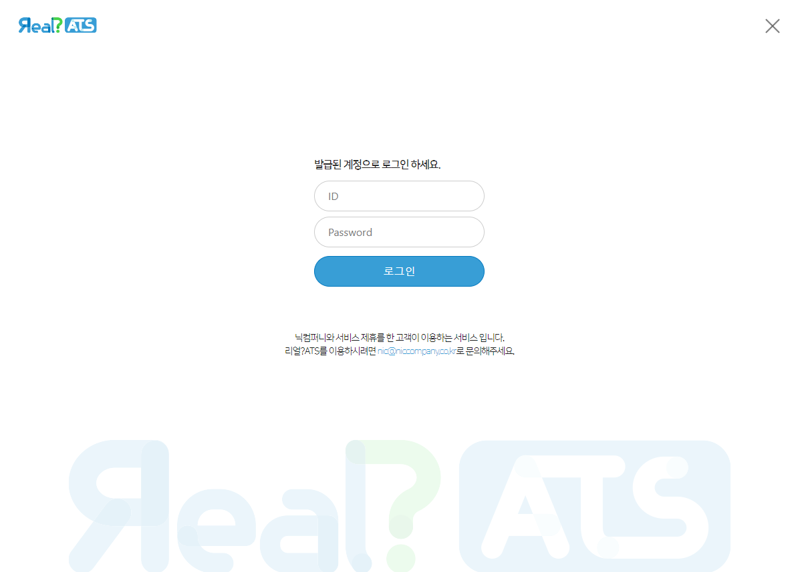
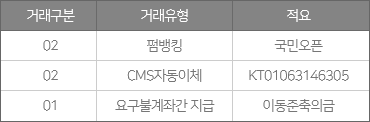
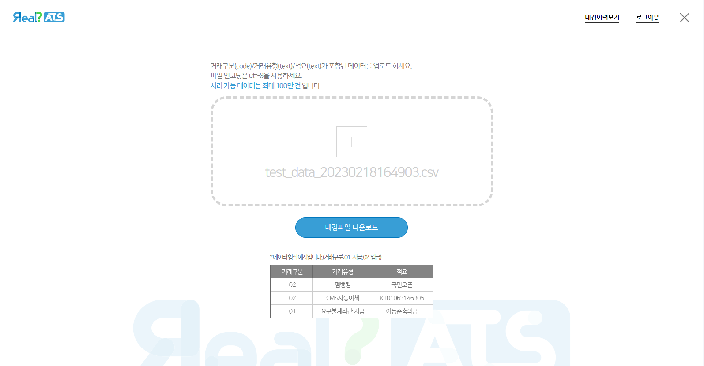

# 🌐 django_web

> **Real? ATS 프로젝트 ver.1**  
본 프로젝트에서는 **Django**를 이용하여 Real? ATS의 **프론트엔드**와 **백엔드**를 구현하였습니다.  
결과물은 [nicreal](https://nicreal.ai/) 에서 확인할 수 있습니다.

  

---

## 📌 웹 특징
1. 적요 텍스트 카테고리 분류  
2. **multiprocessing**을 이용한 병렬 처리  
3. **Dashboard**를 활용한 데이터 분석  

 

---

## 🛠️ 사용 방법

### 1️⃣ 로그인
로그인 문의  
📞 전화번호: 02-2135-3355  
📧 이메일: nic@niccompany.co.kr  

  

 

### 2️⃣ 파일 준비 (.csv)
엑셀(.csv) 파일을 아래 이미지와 같은 형식으로 준비해주세요.  

  

 

### 3️⃣ 태깅 후 기다리기
준비한 파일을 업로드한 후, 잠시 기다리시면 결과 파일을 다운로드할 수 있습니다.  

  

 

---

## 👤 정보

**최승언** – [@velog](https://velog.io/@csu5216) – 📧 colab0658@gmail.com
